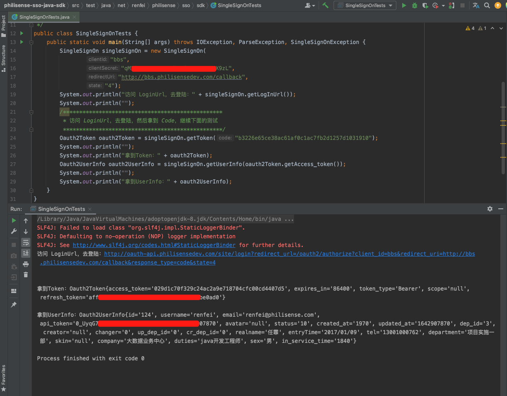

# Phlisense SingleSignOn Java SDK

飞利信大数据业务中心单点登陆 Java 开发包。

单点登陆配置地址：http://app-admin.philisensedev.com/

## Maven
在 pom 文件中添加依赖：
```xml
<dependency>
    <groupId>net.renfei.philisense</groupId>
    <artifactId>philisense-sso-java-sdk</artifactId>
    <version>1.0.0</version>
</dependency>
```

## Jar

可到 Maven 仓库中下载 Jar 包，例如在 GitHub 制品库中下载：

https://github.com/Philisense/philisense-sso-java-sdk/packages/1211568

选择下载 philisense-sso-java-sdk-1.0.0.jar，将 Jar 包放入自己项目的 lib 库中。

## Example

```java
SingleSignOn singleSignOn = new SingleSignOn(
        "clientId",
        "clientSecret",
        "http://demo.philisensedev.com/callback",
        "state");
System.out.println("访问 LoginUrl，去登陆：" + singleSignOn.getLogInUrl());
System.out.println("");
/*************************************************
 * 访问 LoginUrl，去登陆，然后拿到 Code，继续下面的测试
 *************************************************/
Oauth2Token oauth2Token = singleSignOn.getToken("b3226e65ce38ac61af0c1ac7fb2d1257d1031910");
System.out.println("");
System.out.println("拿到Token：" + oauth2Token);
Oauth2UserInfo oauth2UserInfo = singleSignOn.getUserInfo(oauth2Token.getAccess_token());
System.out.println("");
System.out.println("拿到UserInfo：" + oauth2UserInfo);
```

